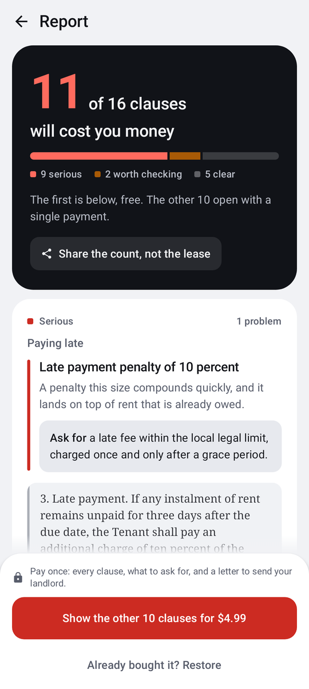
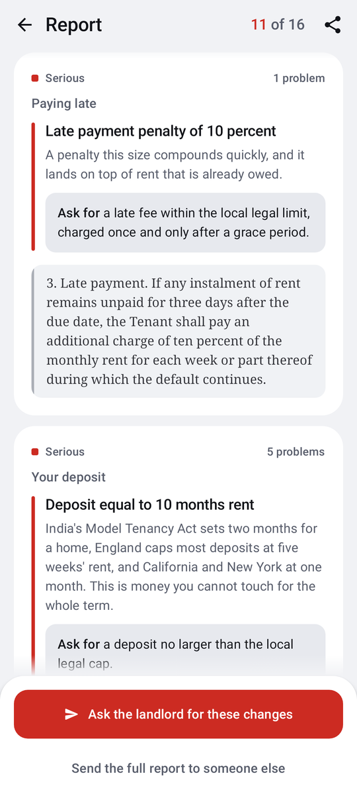

# Redline

Reads a rental lease and points at the clauses that will cost you money.

Everything runs on the device. No account, no upload, no network call at runtime. You
paste the lease or share it from whatever app it arrived in, and the text never leaves
the phone.

<p>
  
  
</p>

The scan always runs to completion and the count is always honest. The first finding is
free, in full, with the sentence it came from. What the purchase buys is the other
eighteen, and a way to send them to whoever can do something about them.

## Why it works the way it does

The obvious build is on-device sentence embeddings: write out a bank of "costly clause"
patterns, embed the lease, rank by cosine similarity. That was the plan.

It was given a test it could fail, and it failed it.

Thirty real lease clauses, twenty costly and ten benign, were labelled and committed
**before** the archetypes existed, so the archetypes could not be shaped around the
answers. Two pass conditions were fixed in advance: top-1 category correct on at least
fourteen of twenty, and a true-positive margin at least three times the benign margin.

| | Embeddings | Rules |
|---|---|---|
| Costly clauses identified | **8 / 20** | **20 / 20** |
| Benign clauses left alone | 3 confident false flags | **10 / 10** |

The interesting part is not that it scored badly. It is *how*. A benign sentence about
paying your own electricity bill produced the second-highest confidence score in the
entire set, higher than fourteen genuinely costly clauses. The failure mode was not
missing bad clauses; it was confidently flagging harmless ones, which is worse than
saying nothing when the reader is trying to decide whether to sign.

So Redline extracts instead of guessing. It finds the actual number, checks it against a
stated limit, and shows you the clause it came from. Every flag can be argued with.

Full working, raw output and reproduction steps: [`eval/README.md`](eval/README.md).

## What it catches

Twenty-seven rules across late fees, deposits, repairs, lock-in periods, notice
requirements, rent escalation, entry rights, occupancy limits, automatic renewal,
deemed service, pass-through charges and restoration costs.

Each finding names the figure it found. "Deposit equal to ten months rent", not
"deposit risk detected".

### How well, measured

| Set | Costly caught | Benign left alone |
|---|---|---|
| Frozen corpus, 30 clauses | 20 / 20 | 10 / 10 |
| Held out, written after the rules | 4 / 5 | 5 / 5 |

The held-out set uses deliberately different language (lessor and lessee, "demised
premises", "surcharge") and none of it was available while the rules were written. The
one miss is documented rather than patched, because editing a rule so a held-out clause
passes turns it into a training clause.

This is why the app says **"no rule matched"** and never "this lease is clean". Rules
catch what they were written to catch, and when they miss they say nothing.

## Verify the monetization in 60 seconds

- Entitlement identifier: `full_report`, declared once in
  [`Billing.kt`](app/src/main/java/dev/kesav/redline/Billing.kt) and nowhere else.
- Entitlement is read from `CustomerInfo` in `Billing.refresh()` and applied **before
  the report renders**, so a paid result is never shown and then withdrawn.
- The price on the button comes from the offering, not from a string in the code.
- Cancelled purchases are not treated as errors.
- The button sells a named package type, never `availablePackages.first()`. Reordering the
  offering in the dashboard, or a product failing to resolve and dropping out, would
  otherwise slide a subscription into that slot and quietly offer a recurring charge to
  somebody reading one lease. `chooseOffer` picks `LIFETIME` by type and has no fallback,
  because selling the wrong thing is worse than selling nothing.
- `Billing.restore()` implements restore on reinstall, and it actually works after one.
  There are no accounts here, so the purchase is keyed to a SHA-256 hash of `ANDROID_ID`,
  which is scoped to the signing key and outlives the app's own storage. Automatic device
  identifier collection is off, so what reaches RevenueCat is stable without being a device
  identifier. `PurchaseIdTest` pins that the hash stays stable, because nothing else here
  would notice if it stopped.
- What the purchase buys is durable. `Report.build` turns the findings into plain text
  and hands it to `ACTION_SEND`, so the lease arrives by share and the argument leaves
  the same way. Nothing is written to disk on the way out. Finding eleven costly clauses
  is only half the job: the tenant still has to raise them with a landlord, and retyping
  nineteen findings into a message is where that stops happening.
- No key in the repository. `BuildConfig.REVENUECAT_API_KEY` is read from
  `local.properties`, which is not committed. With no key the app still builds, runs and
  scans, with the paywall locked.

### What was actually run

On the release-signed APK, not a debug build. That distinction matters here: `ANDROID_ID`
is scoped to the signing key, so debug and release are two different customers and a
result from one proves nothing about the other.

| Step | Result |
|---|---|
| Offering resolves, live price on the button | yes |
| Purchase declined at the store | stays locked, button re-enables, reason shown |
| Purchase completed | every finding reveals, call to action removed |
| Uninstall, reinstall, scan again | unlocked with no tap and no second purchase |

The last row is the one worth reading. A full uninstall takes every local file with it,
so nothing but the derived app user id carries the purchase across, and the report came
back on its own.

The paywall sits **after** the scan. The scan always completes and the count is always
honest; what you pay for is which clauses and why. Charging before the scan would be
charging for something the reader has not yet been given a reason to want.

Three things are given away on purpose, and each one costs a sale in the short run:

- **The count, in full.** "11 of 16 clauses will cost you money" is the finding. Hiding
  the number would raise conversion and would also make the app worthless to anyone who
  declines, which is most people.
- **The whole checklist.** "What Redline checks" lists all 27 rules, grouped, before a
  single rupee changes hands. The counts are derived from the rule table in
  [`Rules.kt`](app/src/main/java/dev/kesav/redline/Rules.kt), so the screen cannot
  advertise a check the scanner does not run, and `TopicsTest` fails the build if the
  two ever drift. A paywall in front of an unexplained judgement is the thing a reader
  is right to distrust.
- **The price, before the work.** It is on the first screen, read from the offering,
  next to the line saying the text never leaves the phone. Learning the cost only after
  reading a lease into the field is the shape of an ambush even when the number is small.

What is left to sell is the part that took the work: which clause, what it says, and why
it costs money. One payment, no subscription, because a tenant signs a lease roughly
once a year and billing them monthly for that would be the actual dark pattern.

## Build

Android SDK with platform 36, and a JDK 17 or newer.

```
git clone https://github.com/Kesav2k04/redline
cd redline
./gradlew :app:assembleDebug
./gradlew :app:testDebugUnitTest
```

The APK lands in `app/build/outputs/apk/debug/`. Nothing else is needed: no keys, no
services to sign up for, and no `local.properties` entries beyond `sdk.dir`. Opening the
folder in Android Studio writes that line for you; from a bare terminal, an `ANDROID_HOME`
pointing at the SDK does the same job and the file can stay absent.

To exercise the purchase flow, add your own key:

```
revenuecat.apiKey=goog_yourkeyhere
```

## How the text gets in

- Paste it.
- Share to Redline from any app (`ACTION_SEND`, `text/plain`).
- Select text anywhere in Android and pick Redline (`ACTION_PROCESS_TEXT`).
- Or tap "Try it on a sample lease".

## Splitting a lease into clauses

Harder than it looks, which is why it has its own tests. Lease text arrives hard wrapped
at an arbitrary column, with words broken across lines by a hyphen, and with the real
structure carried by numbering rather than by blank lines.

[`ClauseSplitter`](app/src/main/java/dev/kesav/redline/ClauseSplitter.kt) rejoins wrapped
lines, repairs hyphenated breaks, treats a new numbered item as a clause boundary even
with no blank line before it, and only then falls back to sentence boundaries for blocks
still too long to be one clause.

[`Numbers`](app/src/main/java/dev/kesav/redline/Numbers.kt) exists because leases spell
their quantities: "ten percent", "ninety days", "two thousand rupees". A rule cannot
compare anything until those are integers.

One bug worth naming, because the test that pins it is more interesting than the fix. On
*"six months notice, failing which three months rent is payable and adjusted against the
deposit"*, the deposit rule read the first months figure it found and announced a
six-month deposit that did not exist. Quantities now have to sit beside the thing they
describe.

## Accessibility

Not a checklist item here, because the people most likely to be handed a bad lease are
not always the people best served by an app.

- Every finding card is one merged announcement rather than five fragments, and it
  includes the clause text itself. Reading out "costly risk, deposit equal to ten months
  rent" and then withholding the sentence would hand a screen reader user the headline
  and keep the evidence.
- A locked finding announces that it is locked and why, so the severity and the count
  are available without paying, exactly as they are on screen.
- Severity carries a word, "Costly" or "Worth checking", not only a colour.
- Touch targets are at least 48dp. The editor scrolls and lifts above the keyboard, so
  the Scan button is reachable at 200% font scale.
- The reveal animation reads `ANIMATOR_DURATION_SCALE` and does nothing when animations
  are turned off device-wide.

## What this is not

Not legal advice. It is pattern matching over contract text, it was written against
Indian residential leases, and it will miss things. Read the clause it shows you.

## Licence

MIT. See [`LICENSE`](LICENSE).
