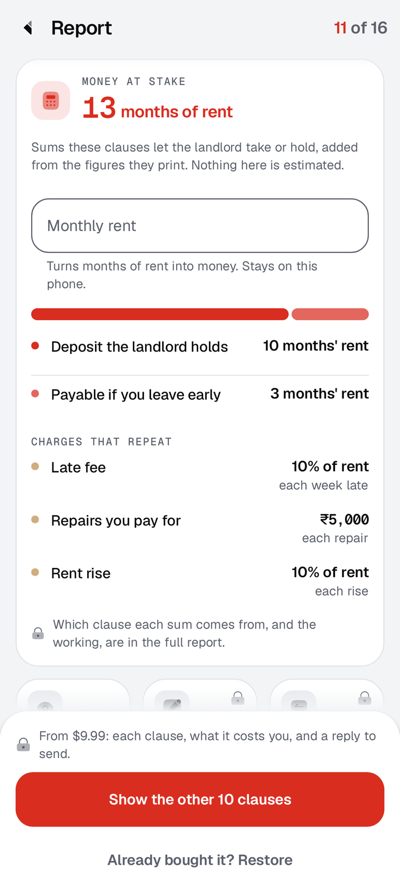
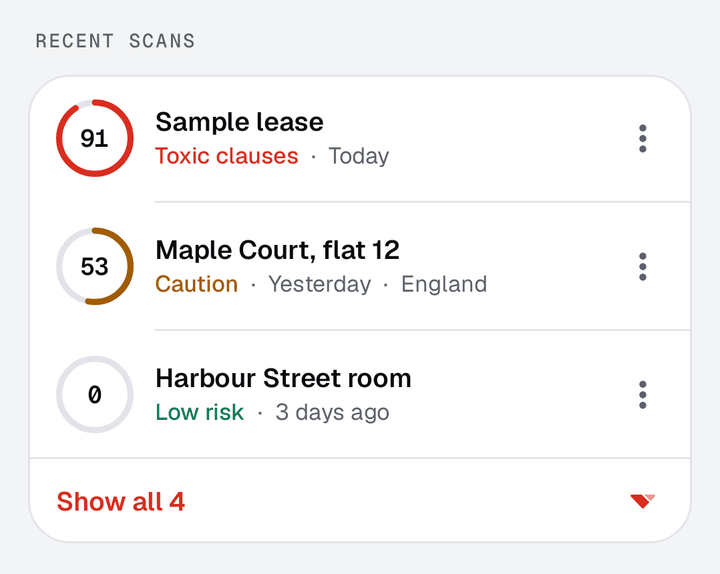
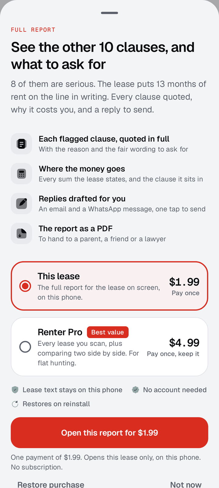

# Redline

Reads a rental lease and points at the clauses that could cost you money.

Built by a student for the Next Gen Award at RevenueCat Shipaton 2026.

Everything that touches the lease runs on the device. No account and no upload. Open the
PDF your landlord sent, scan the paper copy with the camera inside the app, or paste the
text: reading, OCR and the scan all happen on the phone, and the lease never goes over the
network. The app talks to RevenueCat to show the price and take the payment, and Google's
ML Kit text recognition sends Google its usage diagnostics, which Google's disclosure lists
as device, app and performance details, not the text it reads.

<p>
  
  
  
</p>

The scan always runs to completion and the count is always honest. The first flagged
clause is free, in full, with the sentence it came from and what to ask for instead.
What the purchase buys is the other ten clauses and everything found in them, the change
to ask for on each, and a reply to the landlord that asks for all of them.

## In five lines

- **What it does:** reads a lease on the phone (a PDF, pages scanned with the camera, a share
  or a paste), scores it from 0 to 100 and flags the clauses that could cost money, each with
  the figure it found, the sentence it came from and what to ask for instead, naming the law
  for six places.
- **Free:** the scan, the score, the four-area breakdown, the rent at stake, the honest
  count, the first flagged clause in full, the subject of every locked clause, all 38
  checks, and the price.
- **Paid, two ways:** a pass that opens the full report for one lease, or Renter Pro for
  every lease scanned on the phone plus comparing two side by side. Both are read from the
  RevenueCat offering, and Pro carries the `full_report` entitlement.
- **Restore without an account:** Renter Pro is keyed to a salted hash of the device ID,
  so it comes back after an uninstall, checked on the release build.
- **Measured, not assumed:** the rules were chosen over an embedding model on thirty
  clauses labelled before either existed, and the tests include clauses built to break
  them and documents that are not leases.

## What the report shows

**A score out of 100, higher is worse.** Each flagged clause adds weight, 10 for a serious
one and 4 for one worth checking, and the score is `100 * (1 - exp(-weight / 40))`. One
serious clause scores 22, three score 53, five score 71, so the dial rises fast over the
first few problems and slows as a lease runs out of room to get worse. Clauses carry the
weight, not findings, so a paragraph that trips four rules counts once. Under 30 reads
**Low risk**, under 60 **Caution**, and 60 or more **Toxic clauses**. The sample lease has
nine serious clauses and two worth checking, which comes to 91.

**Four areas, scored apart.** Every rule belongs to one: Financial exposure (19 rules),
Privacy & entry (4), Termination traps (9) and Maintenance shifting (6). Each area runs
on the same curve at half the scale, so a single serious clause puts an area at 39, and
`InsightTest` fails the build if a rule is added without an area.

**Rent at stake.** A cost appears only when the clause itself prints a number of months of
rent, a percentage of rent or an amount of money. Nothing is estimated. One-off sums (a
deposit, rent paid up front, what is payable on leaving early) add into the total. A
charge that repeats, such as a late fee for each week late or each repair up to a stated
sum, is listed but never added in, because a total of charges that may or may not recur
would be a guess dressed as a figure. In the sample, a deposit of ten months' rent and
three months payable on leaving early make 13 months in 2 clauses. Months turn into money
when the lease states its monthly rent, or once the reader types it in. The typed figure
stays on the phone and is dropped when another lease is opened.

<p>
  
  
  
</p>

**Clauses the law already overrides.** Once the reader says where the home is, a clause
that fired against that place's own limit is marked void, with the law that voids it.
Only four places have such lines, and each names the statute the finding's reason already
quotes:

| Place | Clause | Law |
|---|---|---|
| California | a deposit over one month's rent, unless the landlord owns no more than two properties | Civil Code 1950.5 |
| California | a deposit held past 21 days after moving out | Civil Code 1950.5 |
| New York | a deposit, with any rent paid in advance, over one month's rent | General Obligations Law 7-108 |
| New York | a deposit held past 14 days (a landlord who misses it keeps none of it) | General Obligations Law 7-108 |
| Massachusetts | a deposit over one month's rent | General Laws ch. 186, s. 15B |
| Massachusetts | a deposit that earns the tenant no interest | General Laws ch. 186, s. 15B |
| England | a deposit over five weeks' rent, or six at 50,000 pounds a year or more | Tenant Fees Act 2019 |
| England | fees beyond rent, deposit and a few named charges | Tenant Fees Act 2019 |
| England | any late fee (only interest on rent 14 days late is allowed) | Tenant Fees Act 2019 |
| England | no-fault eviction under section 21, which ended on 1 May 2026 | Renters' Rights Act 2025 |

Texas and India have none: neither sets a deposit cap, and nothing else there was
confirmed at the level of a statute.

**The lease itself.** The whole lease opens as a page, set in a serif with the clause
numbers in the margin and a marker stroke under every flagged clause. Tapping a mark opens
what was found under it; a locked one shows only its subjects. A rail down the edge shows
where each flag sits in the document, and a tap on it jumps to the nearest one.

**A reply to send.** The drafter writes to the landlord in two channels, because a lease
arrives by email from an agent and by WhatsApp from a private landlord, and a message
written for one reads wrong in the other. It has two tones. **Friendly** is for a first
reply to someone whose flat you want; **Firm, with the law** names the statute where the
law already overrides the clause. Each clause gets proposed replacement wording rather than
a complaint, since a landlord asked "can we change clause 4 to say this" has something to
agree to. Tick the clauses to include, then send the email, open WhatsApp, or copy the text.

**Two leases, side by side.** Every scan is kept on the phone, up to twelve, newest first,
in one JSON file in the app's private storage. The start screen lists them with their
score, tier, date and place, three at a time, and each can be forgotten from its menu.
With Renter Pro, two of them can be compared: score, flagged clauses, serious clauses,
rent at stake and each of the four areas, with a line saying which lease is safer and
why. The store holds the text rather than the result, so both leases are scanned again
with today's rules and a comparison never sets this version's rules against last month's.

**Share the score, not the lease.** The report shares its count with the line "Checked on
my phone before signing. The lease was never uploaded." None of the lease text goes with it.

<p>
  
  
  
</p>

## Verify the monetization in 60 seconds

- Entitlement identifier: `full_report`, declared once in
  [`Billing.kt`](app/src/main/java/dev/kesav/redline/Billing.kt) and nowhere else, and
  attached to the Renter Pro products.
- Entitlement is read from `CustomerInfo` in `Billing.refresh()`. The report is drawn
  locked until that answer arrives, and the buy button stays disabled until then
  (`Billing.known`), so a paid result is **never shown and then withdrawn**, and nobody
  is offered something they already own.
- **Two plans, read from the offering by type, never by position.** `planOf` in
  [`Offers.kt`](app/src/main/java/dev/kesav/redline/Offers.kt) maps `LIFETIME`, `ANNUAL`
  and `MONTHLY` to Renter Pro, and a `CUSTOM` package whose identifier contains `pass`
  (or `single`, or `one_lease`) to the single-lease pass. Anything else is ignored. The
  list arrives in dashboard order, so reading the first package would slide a subscription
  into the pass's place the day someone reorders the offering; selling the wrong thing is
  worse than selling nothing. The paywall offers whichever plans the dashboard holds, pass
  first.
- **A pass opens one lease.** It carries no entitlement. It is recorded on the phone
  against the lease's fingerprint, a SHA-256 of its words with case, spacing and line
  breaks ignored, so the same agreement opened again as a PDF or a paste stays open and a
  different one does not. The paywall promises a restore on reinstall only while Pro is
  the plan chosen.
- The price on the button comes from the offering, not from a string in the code, in the
  reader's own currency at the price set for their country. The price line outside the
  paywall starts at the cheapest plan, says "From" only when there is more than one, and
  "paid once" only when every plan is one payment, so a monthly Pro beside a lifetime one
  never reads as paid once. `PriceLeadTest` pins all three. A yearly or monthly Pro names
  its period on the button, and shows its free trial when the store attaches one ("7 days
  free, then yearly").
- Cancelled purchases are not treated as errors.
- An offline start does not strand the paywall. The offering is fetched again while the
  paywall shows no price, and a tap on the button fetches it before giving up, so the
  price arrives with the signal. An `UpdatedCustomerInfoListener` keeps the entitlement
  current without waiting for a relaunch.
- The line above the price can be changed from the dashboard without a release: set
  `paywall_line` in the offering's metadata, and the app falls back to its own line when
  it is absent.
- Renter Pro comes back on reinstall with no tap. `Billing.start()` gives RevenueCat an app
  user id derived from `ANDROID_ID`, so the first `Billing.refresh()` after a reinstall
  finds the entitlement, and `Billing.restore()` backs the Restore button for anything that
  path misses. There are no accounts here, so the purchase is keyed to a SHA-256 hash of
  `ANDROID_ID`, which is scoped to the signing key and outlives the app's own storage.
  Automatic device identifier collection is off, and what reaches RevenueCat is a salted
  hash, never the raw ID. `PurchaseIdTest` pins that the hash stays stable, because nothing
  else here would notice if it stopped.
- What the purchase buys is durable. The drafter's email and WhatsApp messages,
  `Report.letter` for the landlord and `Report.build` for anyone else all leave through
  `ACTION_SEND`, so the lease arrives by share and the argument leaves the same way. The
  full report also goes as a PDF, written to the app's own cache under one fixed name that
  each send overwrites, and shared through a `FileProvider`. Finding eleven costly clauses
  is only half the job: the tenant still has to raise them with a landlord, and retyping
  every finding into a message is where that stops happening.
- No key in the repository. `BuildConfig.REVENUECAT_API_KEY` is read from
  `local.properties`, which is not committed. With no key the app still builds, runs and
  scans, with the paywall locked.

### What was actually run

On the release-signed APK, not a debug build. That distinction matters here: `ANDROID_ID`
is scoped to the signing key, so debug and release are two different customers and a
result from one proves nothing about the other.

| Step | Result |
|---|---|
| Offering resolves, live price on the button | yes |
| Purchase declined at the store | stays locked, button re-enables, reason shown |
| Purchase completed | every finding reveals, call to action removed |
| Uninstall, reinstall, scan again | unlocked with no tap and no second purchase |

The last row is the one worth reading. A full uninstall takes every local file with it,
so nothing but the derived app user id carries the purchase across, and the report came
back on its own. These runs used the lifetime package, the one plan the offering held at
the time.

The paywall sits **after** the scan. The scan always completes and the count is always
honest; what you pay for is which clauses and why. Charging before the scan would be
charging for something the reader has not yet been given a reason to want.

Three things are given away on purpose, and each one costs a sale in the short run:

- **The count, in full.** "11 of 16 clauses could cost you money" is the finding. Hiding
  the number would raise conversion and would also make the app worthless to anyone who
  declines, which is most people.
- **The whole checklist.** "See all 38 checks" opens every rule, grouped into nine
  subjects, before any money changes hands. The counts are derived from the rule table in
  [`Rules.kt`](app/src/main/java/dev/kesav/redline/Rules.kt), so the screen cannot
  advertise a check the scanner does not run, and `TopicsTest` fails the build if the
  two ever drift. A paywall in front of an unexplained judgement is the thing a reader
  is right to distrust.
- **The price, before the work.** It is on the first screen, read from the offering, in
  the line under the sample lease that says the scan, the score and the count are free.
  Learning the cost only after reading a lease into the field is the shape of an ambush
  even when the number is small.

What is left to sell is the part that took the work: which clause, what it says, and why
it costs money. Someone reading one lease buys it for that lease. Someone reading several
buys Renter Pro, which the dashboard can sell once, yearly or monthly.

## Why it works the way it does

The obvious build is on-device sentence embeddings: write out a bank of "costly clause"
patterns, embed the lease, rank by cosine similarity. That was the plan.

It was given a test it could fail, and it failed it.

Thirty real lease clauses, twenty costly and ten benign, were labelled and committed
**before** the archetypes existed, so the archetypes could not be shaped around the
answers. Two pass conditions were fixed in advance: top-1 category correct on at least
fourteen of twenty, and a true-positive margin at least three times the benign margin.

| | Embeddings (Universal Sentence Encoder) | Rules |
|---|---|---|
| Costly clauses identified | **8 / 20** | **20 / 20** |
| Benign clauses left alone | 2 of 10 scored above the median correct match | **10 / 10** |

The interesting part is not that it scored badly. It is *how*. A benign sentence about
paying your own electricity bill scored higher than sixteen of the twenty genuinely
costly clauses, and higher than any other harmless one. The failure mode was not
missing bad clauses; it was confidently flagging harmless ones, which is worse than
saying nothing when the reader is trying to decide whether to sign.

That model dates from 2018, and a newer one would score higher; the case for rules does
not rest on this score. It rests on what rules give a reader and a model does not: the
same answer every time, a quoted sentence behind every flag, and no cost per scan.

So Redline extracts instead of guessing. It finds the actual number, checks it against a
stated limit, and shows you the clause it came from. Every flag can be argued with.

Full working, raw output and reproduction steps: [`eval/README.md`](eval/README.md).

## What it catches

Thirty-eight rules in nine subjects, across late fees, deposits, repairs, lock-in periods,
notice requirements, rent escalation, entry rights, occupancy limits, automatic renewal,
deemed service, pass-through charges, legal costs, liability waivers and restoration
costs. The first twenty-seven were written against Indian leases. Eleven more came from
a set of US and English clauses, which took the scanner from 6 to 18 of 26 costly US
clauses and from 3 to 13 of 19 English ones, with fewer false flags on both, and left
every Indian result where it was. That set shaped the new rules, so it is a regression
check rather than a measure of how far they reach.

Each finding names the figure it found. "Deposit equal to ten months rent", not
"deposit risk detected".

### How well, measured

| Set | Costly caught | Benign left alone |
|---|---|---|
| Frozen corpus, 30 clauses | 20 / 20 | 10 / 10 |
| Held out, 10 clauses written after the rules | 4 / 5 | 5 / 5 |
| A whole US lease, 16 clauses, first run | 6 / 9 | 7 / 7 |

The held-out set uses deliberately different language (lessor and lessee, "demised
premises", "surcharge") and none of it was available while the rules were written. The
one miss is documented rather than patched, because editing a rule so a held-out clause
passes turns it into a training clause.

The US lease was written after the rules, in the wording US leases use. On its first
run it also read a renewal term as a notice period. Those misses were then fixed, so
it is a regression check now, and the account is in
[`eval/README.md`](eval/README.md#a-whole-us-lease).

This is why the app says **"no rule matched"** and never "this lease is clean". Rules
catch what they were written to catch, and when they miss they say nothing.

### What those numbers were hiding

The 20 of 20 hid two problems, both found by trying to break it and both fixed: text
that is not a lease (a pasted recipe was told "the landlord alone decides what to
deduct"), and rules reading the wrong number ("escalated" contains "late"). The full
account, the fixes and the tests that pin them are in
[`eval/README.md`](eval/README.md#what-the-corpus-was-hiding).

## Build

Android SDK with platform 36, and a JDK 17 or newer.

```
git clone https://github.com/Kesav2k04/redline
cd redline
./gradlew :app:assembleDebug
./gradlew :app:testDebugUnitTest
```

The APK lands in `app/build/outputs/apk/debug/`. Nothing else is needed: no keys, no
services to sign up for, and no `local.properties` entries beyond `sdk.dir`. Opening the
folder in Android Studio writes that line for you; from a bare terminal, an `ANDROID_HOME`
pointing at the SDK does the same job and the file can stay absent.

`./gradlew :app:testDebugUnitTest -Pshots` also renders each screen on the JVM with
Roborazzi and writes the images to `app/build/shots/`. The screenshots in this README
come from there.

Most of the release APK is the on-device OCR model for three processor types. While it
uses RevenueCat's Test Store the release build has to be debuggable, which also keeps R8
from shrinking it; a Play Store key turns both back on.

To exercise the purchase flow, add your own key:

```
revenuecat.apiKey=goog_yourkeyhere
```

## How the text gets in

A lease usually arrives as a PDF or on paper, so those come first.

- **Open a PDF.** On Android 15 and later the text layer is read directly with
  `PdfRenderer`. A scanned PDF, or any PDF on an older phone, is rendered page by page and
  read with ML Kit's bundled text recognition, which runs on the phone and needs no
  download. Up to 30 pages. The file is copied to the app's cache for the renderer and
  deleted as soon as reading finishes.
- **Scan paper**, page by page, with the camera inside the app (CameraX). Boxes follow the
  text ML Kit finds in the preview, the cue turns to "Steady. Take the photo." once the
  page holds still, and there is a torch for a dim room. Each page is read while the next
  is framed, and its photo is deleted once the text is out. This is the one permission the
  app asks for; turning it down leaves a photo or a PDF already on the phone open to read.
- **Open with Redline** on a PDF (`ACTION_VIEW`), or **share to Redline** from Gmail,
  WhatsApp or Files, for a PDF, an image or plain text (`ACTION_SEND`).
- Paste it, or select text anywhere in Android and pick Redline (`ACTION_PROCESS_TEXT`).
- Or tap "No lease to hand? Open a sample lease".

Imported pages are rebuilt into paragraphs before the scan: page numbers and running
headers are dropped, wrapped lines are rejoined, and headings and numbered clauses start
new paragraphs. A test holds the PDF path to the pasted path, so the same lease gives the
same findings however it arrived.

## What it asks for

A finding that stops at "this is bad" leaves the reader with a problem and no next move.
Every rule carries the change to ask for: "a deposit no larger than the local legal cap",
"at least 24 hours written notice before any entry, except in an emergency". It appears
on the card under the reason.

"The local legal cap" sends the reader off to look the number up. So the report asks,
once, **where the home is**, and keeps the answer on the phone. For six places the asks
and reasons then carry that place's own figure and the law it comes from. In
Massachusetts the free late-fee card says "no late fee or interest until rent is 30 days
overdue, as Massachusetts General Laws chapter 186, section 15B requires", under a clause
that charges one after three days. The thresholds move too: a two-month deposit is
flagged in New York, where the cap is one month, and not in Texas, which sets none.

| Place | Deposit cap | Deposit back within | Late fee |
|---|---|---|---|
| California | 1 month (2 for a landlord with at most two properties) | 21 days | a fair estimate of the cost only |
| New York | 1 month | 14 days | after 5 days, the lesser of $50 or 5% |
| Massachusetts | 1 month | 30 days | none until 30 days overdue |
| Texas | none | 30 days | after 2 full days, presumed fair up to 10% (12% in small buildings) |
| England | 5 weeks | 10 days after agreeing the amount | none; interest only, after 14 days |
| India | none in most states; the Model Tenancy Act proposes 2 months | | |

Every figure was read in the statute or on an official page, cited beside it in
[`Places.kt`](app/src/main/java/dev/kesav/redline/Places.kt). What could only be
confirmed second-hand was left out rather than guessed: England's entry notice, and the
late-fee percentages Californian and Massachusetts courts tend to accept. Anywhere else,
the general wording stays. `PlacesTest` pins the moved thresholds with one clause each: a
two-month deposit (flagged in California, New York, Massachusetts and England, not in
Texas, India or with no place chosen), a deposit returned in twenty days (late in New
York, not in California or with no place), and a five percent late fee (flagged by
default, not in Texas).

After purchase, **Ask the landlord for these changes** opens the letter before it goes:
one line per flagged clause with a tick box (serious ones start ticked), and underneath,
exactly the text that will be sent. The letter is built from the asks, grouped by clause
number, in the first person of someone who still wants the flat. It carries no verdicts
and no quotes of the scanner's reasons, because the landlord wrote the lease and does not
need to be told it is unfair. It leaves through the share sheet, so the app never holds
an address or a copy. The full report, with every clause quoted and every reason, still
goes to a parent or an adviser from the same screen, as text and a PDF.

## Splitting a lease into clauses

Harder than it looks, which is why it has its own tests. Lease text arrives hard wrapped
at an arbitrary column, with words broken across lines by a hyphen, and with the real
structure carried by numbering rather than by blank lines.

[`ClauseSplitter`](app/src/main/java/dev/kesav/redline/ClauseSplitter.kt) rejoins wrapped
lines, repairs hyphenated breaks, treats a new numbered item as a clause boundary even
with no blank line before it, and only then falls back to sentence boundaries for blocks
still too long to be one clause.

[`Numbers`](app/src/main/java/dev/kesav/redline/Numbers.kt) exists because leases spell
their quantities: "ten percent", "ninety days", "two thousand rupees". A rule cannot
compare anything until those are integers.

One bug worth naming, because the test that pins it is more interesting than the fix. On
*"six months notice in writing, failing which three months rent shall be payable as
liquidated damages and shall be adjusted against the deposit"*, the deposit rule read the first months figure it found and announced a
six-month deposit that did not exist. Quantities now have to sit beside the thing they
describe.

## Accessibility

Not a checklist item here, because the people most likely to be handed a bad lease are
not always the people best served by an app.

- Every finding card is one merged announcement rather than a string of fragments, and it
  includes the clause text itself. Reading out "costly risk, deposit equal to ten months
  rent" and then withholding the sentence would hand a screen reader user the headline
  and keep the evidence.
- The locked list is one spoken sentence: each subject, how many clauses sit under it,
  and whether they are serious, so the count and the severity reach a screen reader
  before paying, as they reach the eye.
- On every open card severity carries a word, "Serious" or "Worth checking", not only a
  colour.
- Each recent scan is one spoken line, and forgetting it is a TalkBack action as well as
  a menu item.
- Touch targets are at least 48dp. The editor scrolls and lifts above the keyboard, so
  the Scan button is reachable at 200% font scale.
- The reveal animation reads `ANIMATOR_DURATION_SCALE` and does nothing when animations
  are turned off device-wide.

## What this is not

Not legal advice. It is pattern matching over contract text, it was written against
Indian residential leases and extended with US and English clauses, and it will miss
things. Read the clause it shows you.

## Credits

- [Geist and Geist Mono](https://github.com/vercel/geist-font), by the Geist Project
  Authors, and [Source Serif 4](https://github.com/adobe-fonts/source-serif), by Adobe,
  under the SIL Open Font License 1.1. The licence texts are in
  [`licenses/`](licenses).
- The [Solar](https://icon-sets.iconify.design/solar/) icon set, by 480 Design, under
  [CC BY 4.0](https://creativecommons.org/licenses/by/4.0/), fetched from the Iconify API.

## Licence

MIT. See [`LICENSE`](LICENSE).
