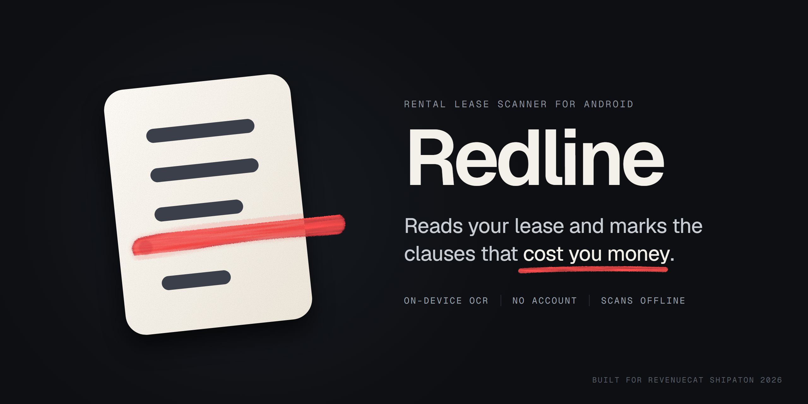
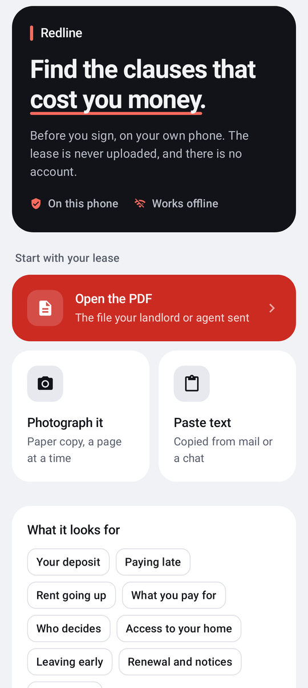
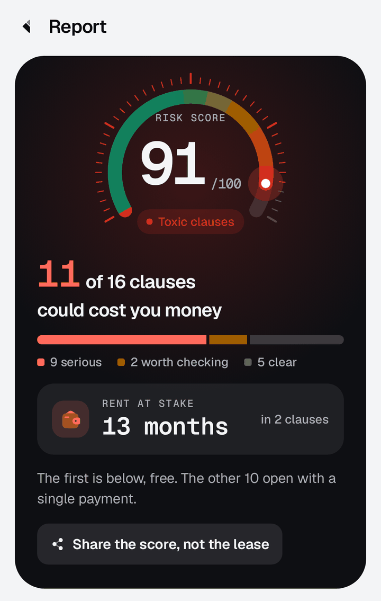
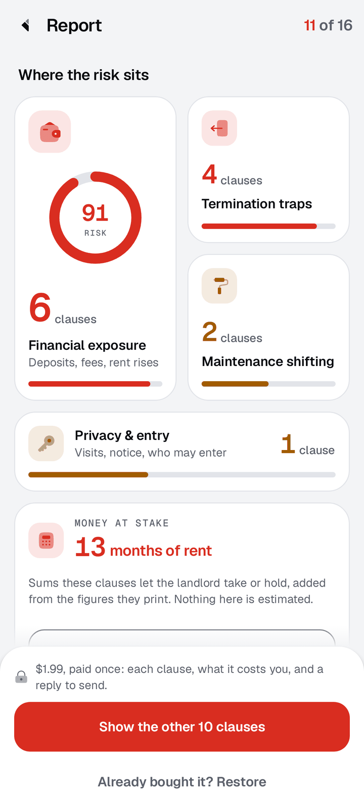
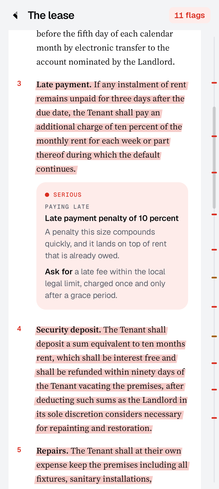
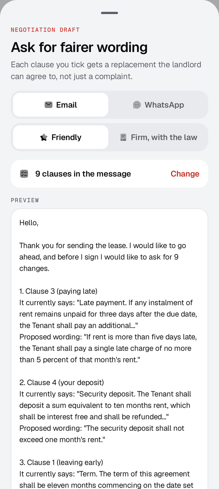
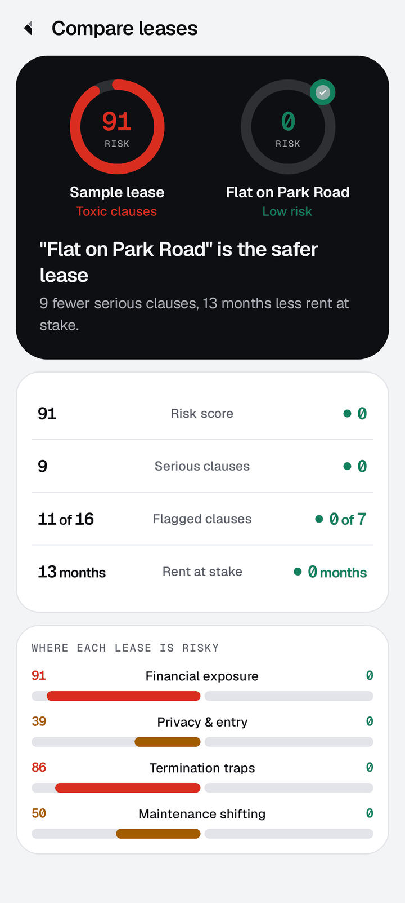
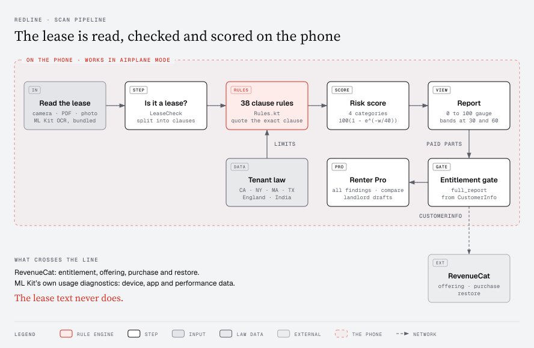
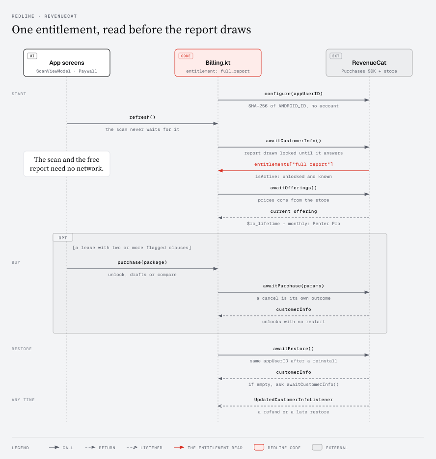

<p align="center">
  
</p>

# Redline

**Reads a rental lease on your phone and marks, in red, the clauses that could cost you money.**

A lease arrives with twenty minutes to sign it. The clauses that take your money are the quiet ones: a deposit of ten months' rent, a refund that waits ninety days, repairs deducted "in the landlord's sole discretion". Redline looks for them, works out what each one costs you and, where a local law caps it, cites the statute. The lease text never leaves the phone. No account, no login, no upload.

**Try it in one minute:** install `app-release.apk` from the [v1.0.0 release](https://github.com/Kesav2k04/redline/releases/tag/v1.0.0), tap **No lease to hand? Open a sample lease**, and turn on airplane mode first if you like. The scan runs entirely on the phone.

<p align="center">
  
  
  
</p>

<p align="center">
  
  
  
</p>

Every screenshot in this README is rendered from the app's own Compose code by the Roborazzi tests in `app/src/test` (`./gradlew :app:testDebugUnitTest -Pshots`), so each image is the real interface, not a mockup.

## In five lines

- **What it does:** reads a lease on the phone (a PDF, a camera scan, a shared file or pasted text) and runs 38 rules over it: late fees, deposits, leaving early, entry rights and upkeep, quoting the exact clause and citing tenant law for six places.
- **What you see:** a lease card that tilts in 3D under your finger, a 0 to 100 risk gauge, a four-part bento grid, highlighter strokes under each flagged clause, a reply drafter, and a side-by-side comparison of two leases.
- **Free:** the scan, the gauge, the bento grid, the clause count, the first flagged clause in full, the topic of every locked clause, and the list of all 38 checks.
- **Paid:** **Renter Pro**, read from the RevenueCat offering and sold for good or by the month, opens every lease plus the comparison under the `full_report` entitlement.
- **Private by construction:** OCR and every rule run on the phone, there is no account, and Renter Pro comes back after a reinstall with no sign-in.

## How it works

<p align="center">
  
</p>

Everything inside the dashed line runs on the phone, so document analysis needs no server and a scan works in airplane mode. ML Kit reads the page with a model bundled in the APK, `LeaseCheck` turns away text that is not a lease, and the 38 rules in `Rules.kt` run over each clause with the tenant law of the chosen place beside them. `Insight.kt` scores the findings as `100 * (1 - exp(-weight / 40))`, where a serious clause weighs 10 and one worth checking weighs 4, and splits the risk across the four categories. The one line that crosses the boundary goes to RevenueCat; everything that leaves the phone, and what never does, is listed under [What leaves the phone](#what-leaves-the-phone).

## Product experience

### The scan
Photograph a paper lease inside the app. CameraX feeds ML Kit text recognition about five times a second, boxes appear over the text it has found, and the screen tells you when the page is steady enough to shoot. The shutter answers with a haptic tap, the torch is one button away, and a long lease goes in page by page in one scan.

### The lease card
The start screen holds a lease drawn in 3D with Compose graphics layers. Drag it and the page tilts under your finger; let go and a spring brings it back.

### The report
A 0 to 100 gauge drawn with a sweep gradient leads the report: **Low risk** under 30, **Caution** from 30 to 59, **Toxic clauses** from 60. Under it, the bento grid splits the risk into Financial exposure, Privacy & entry, Termination traps and Maintenance shifting. A money card works out the sums the lease itself states, so the tenant reads a figure rather than a warning. Where a clause has no effect under local law, a separate card names the law.

### The document
The whole lease, set in Source Serif, with every flagged clause marked by an irregular highlighter stroke drawn under the text. Tap a mark to open the finding. A rail down the right edge shows where every mark sits.

### The reply
Finding the problem is half the job; the tenant still has to answer the landlord. Redline drafts the reply as a formal email or a short WhatsApp message, in a friendly or a firm tone.

### Two flats, side by side
Scans are saved on the phone. Open two and a butterfly chart sets their risk against each other across all four categories.

## Verify the monetization in 60 seconds

<p align="center">
  
</p>

Every call into the RevenueCat SDK sits in `Billing.kt`. The screens read its state, and `Offers.kt` only sorts the packages it returns.

- **Entitlement:** `full_report`, defined in `Billing.kt` and read from `CustomerInfo`.
- **After the scan, never before it:** the scan always runs to completion and the count is honest. A lease with only one flagged clause, or text that is not a lease, is shown in full for free, so the paywall never asks money for nothing.
- **Plans from the offering:** `Offers.kt` reads the packages from the RevenueCat offering. Lifetime, annual and monthly packages become Renter Pro; the current offering carries a lifetime package (`$rc_lifetime`, a one-time purchase) and a monthly one. A custom package whose id named a pass would become This lease; the current offering has none. No price is written in the app code.
- **Honest price line:** "From" appears only when more than one plan is on offer, and "paid once" only when no plan recurs. The price shows on the home screen before any scan, so nobody meets it for the first time behind a lock.
- **Honest button state:** the report is drawn locked until `CustomerInfo` answers, and the buy button stays disabled until ownership is known, so a paid report never flashes open and nobody is asked to buy what they own.
- **Restore without an account:** the RevenueCat app user ID is a salted SHA-256 hash of `ANDROID_ID`, which Android fixes per signing key, user and device. On an Android 16 emulator (API 36), Renter Pro survived an uninstall and reinstall: the report opened in full on first launch, before Restore was tapped.
- **Offline:** without a network the scan still runs and the paywall waits. An `UpdatedCustomerInfoListener` applies entitlement changes as they arrive, with no restart.
- **No keys in the repo:** `BuildConfig.REVENUECAT_API_KEY` comes from `local.properties`. Built without one, the app compiles and scans, and the paywall stays locked.

## What leaves the phone

- **The lease text: nothing.** OCR is ML Kit text recognition 16.0.1, bundled in the APK with its model (about 11 MB per ABI), so a scan works in airplane mode.
- **RevenueCat** is contacted for prices, purchases and restores.
- **Google's ML Kit library** sends its own usage diagnostics (device, app and performance data, not the recognised text), as described in its [data disclosure](https://developers.google.com/ml-kit/android-data-disclosure).

## Why rules instead of embeddings

Thirty real lease clauses (twenty costly, ten benign) were labelled before a rule was written, with two pass marks set in advance: the right category for at least 14 of the 20, and true-positive margins at least three times the benign margin.

| Approach | Costly clauses caught | Margin ratio (pass needs 3x) |
|---|---|---|
| Embeddings (Universal Sentence Encoder, two runs) | 8 / 20 | 1.14x and 0.89x |
| Deterministic rules | 20 / 20, benign 10 / 10 | not applicable |

The embeddings did worse than miss. A clause saying the tenant pays their own electricity scored higher than sixteen of the twenty costly clauses. The rules were written with those thirty clauses open, so their result only proves they fire where intended. The fairer numbers come from clauses they had never seen:

| Set | Costly caught | Benign left alone |
|---|---|---|
| Held-out clauses, written afterwards in different wording | 4 / 5 | 5 / 5 |
| United States leases | 18 / 26 | 25 / 29 |
| English leases | 13 / 19 | 20 / 20 |

Rules give three things a model cannot: the exact sentence behind every flag, the same output on every run, and no network or inference cost per scan. When no rule fires, the report says "Nothing matched" rather than calling the lease clean. The misses and their reasons are written up in [`eval/README.md`](eval/README.md).

## Regional statutory support

| Place | Deposit cap | Deposit back within | Late fees | Law cited |
|---|---|---|---|---|
| California | 1 month (2 for small landlords) | 21 days | Fair estimate of the landlord's cost | Civil Code 1950.5, 1671 |
| New York | 1 month | 14 days | Only after 5 days late; lesser of $50 or 5% | General Obligations Law 7-108, Real Property Law 238-a |
| Massachusetts | 1 month | 30 days | None until rent is 30 days overdue | M.G.L. ch. 186 § 15B |
| Texas | No cap | 30 days after a forwarding address | 12% (four homes or fewer) or 10%, after 2 full days | Property Code 92.103, 92.019 |
| England | 5 weeks' rent (6 at £50,000 a year or more) | 10 days from agreement | No fee; interest at most 3% over base rate, once 14 days late | Tenant Fees Act 2019 |
| India | None in most states; the Model Tenancy Act proposes 2 months, Tamil Nadu sets 3 | No figure used | No figure used | Model Tenancy Act 2021 |

## Build and run

Requires Android SDK 36 and JDK 17 or newer. No API key is needed to build or test.

```bash
git clone https://github.com/Kesav2k04/redline.git
cd redline
./gradlew :app:assembleDebug
./gradlew :app:testDebugUnitTest
```

177 unit tests in 31 suites: 176 pass, 1 is skipped and none fail. The debug APK is written to `app/build/outputs/apk/debug/app-debug.apk`.

To regenerate the screenshots in this README with the Roborazzi tests:

```bash
./gradlew :app:testDebugUnitTest -Pshots
```

## Accessibility

- Motion follows Android's animator duration scale, so with animations off, transitions are skipped.
- Screens are render-tested at 200% font scale.
- Rows and buttons hold a 48dp minimum touch target.

## Legal notice

Redline is a contract inspection tool that highlights clauses based on defined rules and public statutes. It does not provide legal advice. Tenants should review the highlighted text and consult qualified legal counsel for dispute resolution.

## Licenses

- Redline application code: MIT License ([`LICENSE`](LICENSE)).
- Geist and Geist Mono typefaces: SIL Open Font License 1.1 ([`licenses/Geist-OFL.txt`](licenses/Geist-OFL.txt)).
- Source Serif 4 typeface: SIL Open Font License 1.1 ([`licenses/SourceSerif4-OFL.txt`](licenses/SourceSerif4-OFL.txt)).
- Solar duotone icons: Creative Commons Attribution 4.0 International ([`licenses/Solar-CC-BY-4.0.txt`](licenses/Solar-CC-BY-4.0.txt)), Copyright 480 Design.
